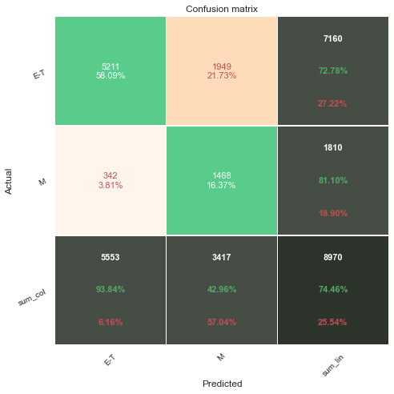

Carl Cook

Capstone Project

Predicting Video Game Ratings Through Image Classification with CNNs

# Introduction

In this project, my goal is to train convolutional neural networks to identify a video game's ESRB rating based on an image from that game. The primary concern will be identifying M-rated games. If a model can successfully be trained to identify M-rated games, it could be helpful in identifying mature content on platforms such as Twitch or YouTube where streamers might not have content restrictions in place on their channels. While users on these platforms do have the ability to report channels such as these, predictions from a successful model could flag these channels earlier, preventing more young people from viewing content intended for mature audiences.

# Obtain

In a previous project, I compiled a DataFrame of games and ratings from the ESRB site. Using that DataFrame, I scraped images from Google Images. I pulled 10 images for each game by searching the game's title along with 'video game screenshot.'

# Scrub

Outside of visually confirming each image is a screenshot of the correct game, I couldn't think of a reliable way to make sure that the data is clean. For this stage, I mainly focused on scripts to divide the images into subdirectories for train, validation, and test sets based on game ratings.

This process can be reviewed in the data_split notebook.

# Explore

Using ImageDataGenerator, I pulled up a batch of 32 images and their labels from the train set. Some noise was randomly added to images to help with generalization. Upon viewing the images, it certainly is not an easy task to identify a game's rating from a single image.

# Model

In this phase, I started with a simple neural network. I didn't expect great results from it, but I wanted to use it as a baseline to see if the additional complexity of CNNs provided significantly better results.

## Model 1

The first model gave an overall accuracy of about 40%, but only had 27% recall for M-rated games.

## Model 2

Model 2 included four convolutional blocks, each with two convolutional layers, a pooling layer, and a dropout layer.

This increased the overall accuracy to 47%, but more importantly raised the recall score to nearly 60%. And with a precision score also over 50%, this model looked much more promising that the first.

## Model 3

For Model 3, I used a similar model architecture, but I added a BatchNormalization layer to each block and added class weights to the compile function.

I'm not sure I understand how, but even with the class weights factored in, this model overestimated the T class more than either of the first two. Recall dropped about 12% for the M class as well, making this model less effective than Model 2.

## Model 4

For the fourth model, I used the VGG-16 pretrained model with a few layers added to the end to allow some fitting to this data set.

This model was able to break 50% for overall accuracy, but only managed 53% recall for the M class. Precision rose to 60%, but this model ultimately found mature content less often than Model 2.

## Model 5

For the fifth model, I decided to combine classes E-T to create a binary classification problem. I used the VGG architecture again and made new class weights. Although class weights didn't help my earlier model, the class imbalance was definitely to extreme to ignore in this case.

This model achieved an 81% recall for M-rated games. With just 43% precision, this did mean a lot of false positives, but it seemed acceptable given the jump in recall.

# Evaluate

In order to try to better understand what the model was finding in these images, I looked at the outputs of the 5 blocks of the VGG architecture. The images are a bit cryptic, and they don't necessarily offer much in the way of insight as to how the model makes its predictions, but it does certainly show that the model is finding distinct features within each image.

# Conclusion

The binary classification model turned out to be the most effective at identifying mature content, but further tweaking might improve the model. I also believe that stacking models to predict ratings based on multiple images of the same game could prove effective, but I haven't had any impressive results with that strategy as of yet. Results could also be improved with more consistent data, I think. For example, while a gameplay screenshot of an M-rated game might be recognizably mature, a screenshot of its pause menu or inventory screen might not. Data of this consistency, though, would be difficult and time-consuming to collect.

In conclusion, while the model was able to make some good predictions, it's not accurate enough to trust the model to automated content filtering. It would be effective, though, as an automated flagging tool, grabbing screenshots from livestreams and flagging channels that could warrant human review.
